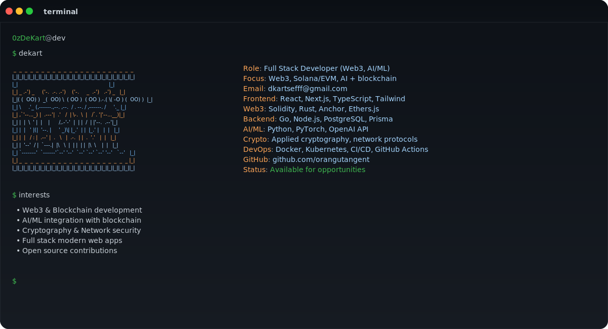

## Hi, I'm Denis 👋

```bash
$ whoami
> Full Stack Developer (Web3, AI/ML)
> Building secure, high-performance modern web applications
```

## 🚀 About Me

I'm a **Full Stack Developer** passionate about building innovative applications, with expertise in Web3, blockchain technology, and AI/ML integration.

Skilled in writing backend applications in **Go** and smart contracts in **Solidity** and **Rust**, and integrating them into modern web applications. I'm passionate about combining blockchain and AI with solid machine learning knowledge.

**Email:** dkartsefff@gmail.com  
**GitHub:** [@orangutangent](https://github.com/orangutangent)  
**Telegram:** [@rusttle](https://t.me/rusttle)  
**Twitter:** [@0xDeKart](https://twitter.com/0xDeKart)

## 🎯 Core Stack

```bash
$ core --focus

Frontend    : Next.js, TypeScript, Tailwind CSS
Backend     : Go, PostgreSQL
Web3        : Solidity, Ethers.js, Rust (Solana, TON)
AI/ML       : Python, PyTorch, OpenAI API
DevOps      : Docker, GitHub Actions, Linux
```

## 📚 Also Familiar With

```bash
$ stack --extended

Frontend    : React, Vue.js, Nuxt.js, SCSS/Sass, Framer Motion, Vite
            : Redux, Pinia, Jest, Cypress

Web3        : Anchor, Wagmi, Web3Modal, Hardhat, Foundry, Chainlink
            : OpenZeppelin, LayerZero, Metaplex, Tact (TON)

Backend     : Node.js, NestJS, FastAPI, MongoDB, Prisma, RabbitMQ

DevOps      : Kubernetes, Minikube, Nginx, Traefik, Vercel, Bash

AI/ML       : TensorFlow, Scikit-learn, NumPy, Pandas, LangChain
            : Hugging Face, Matplotlib, Seaborn

APIs        : REST APIs, GraphQL
```

## 🧰 Tech Icons

<div align="center">

[](https://skillicons.dev)

[](https://skillicons.dev)

[](https://skillicons.dev)

</div>

## 💻 What I've Worked With

```bash
$ experience --summary

Frontend Development:
  - Built responsive SPAs and SSR applications with React, Next.js, Vue.js
  - Created custom design systems and reusable component libraries
  - Integrated third-party APIs (Steam, payment systems, etc.)
  - Implemented complex state management and real-time features
  - Developed interactive UIs with animations and modern UX patterns

Web3 & Blockchain:
  - Developed smart contracts in Solidity (Ethereum) and Rust (Solana, Anchor)
  - Built smart contracts on TON blockchain using Tact and TON
  - Built decentralized applications on Ethereum, Solana, and TON
  - Integrated wallet connections and cross-chain protocols (LayerZero)
  - Worked with Chainlink oracles, OpenZeppelin standards, Metaplex
  - Implemented token swaps, NFT marketplaces, and DeFi features

Backend & Infrastructure:
  - Built REST APIs and GraphQL endpoints with Go, Node.js, FastAPI
  - Designed database schemas and optimized queries (PostgreSQL, MongoDB)
  - Set up CI/CD pipelines and containerized applications (Docker, Kubernetes)
  - Managed deployments on Vercel and cloud providers
  - Implemented message queues and microservices architecture

AI/ML Integration:
  - Fine-tuned vision-language models for code generation tasks
  - Integrated LLM APIs (OpenAI, Groq) for intelligent features
  - Built AI-powered task classification and text structuring systems
  - Worked with PyTorch, Hugging Face, and model fine-tuning techniques

Cryptography & Networks:
  - Worked with secure protocols and network technologies
  - Implemented encryption and security best practices
  - Explored applied cryptography and distributed systems
  - Familiar with network protocols and secure communication
```

## 🎯 What I'm Into

```bash
$ interests

- Web3 Development - Building decentralized applications on Ethereum and Solana
- Smart Contracts - Solidity and Rust for secure blockchain solutions
- AI/ML Integration - Combining machine learning with blockchain technology
- Full Stack Development - End-to-end application development
- Modern Web Technologies - React, Next.js, TypeScript, and modern tooling
- DevOps - Docker, Kubernetes, CI/CD pipelines
- Open Source - Contributing to the developer community
```

## 📚 Education

```bash
$ education

Bachelor's degree in Computer Science
Tomsk Polytechnic University (2022 – present)
Focus: Web development and machine learning
```

## 🔍 Looking For

```bash
$ opportunities

Interested in exciting projects in Web3 and modern web development. Open to:
- Full-time remote positions
- Freelance projects
- Open source contributions
- Collaborations on innovative projects
```

## 📬 Contact

```bash
$ ping dekart

Email    : dkartsefff@gmail.com
GitHub   : https://github.com/orangutangent
Telegram : https://t.me/rusttle
Twitter  : https://twitter.com/0xDeKart
```

## ☕ Fun Facts

```bash
$ cat fun_facts.txt

- Passionate about combining blockchain and AI technologies
- Always learning new technologies and frameworks
- Enjoys building performant and secure applications
- Coffee enthusiast ☕
- Ready for new challenges!
```

---

<div align="center">

**Thanks for visiting! Feel free to reach out if you want to collaborate or chat about Web3, AI, or development! 🚀**

</div>
